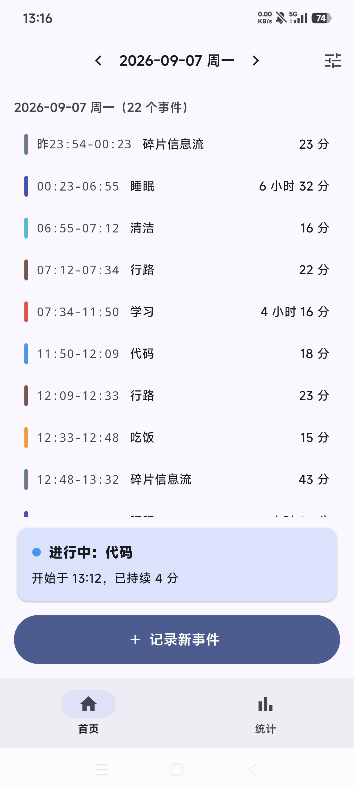
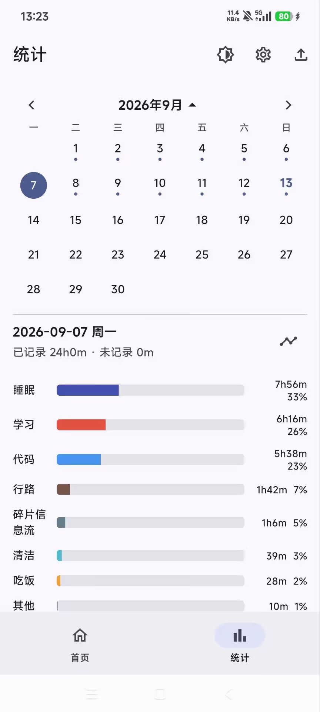
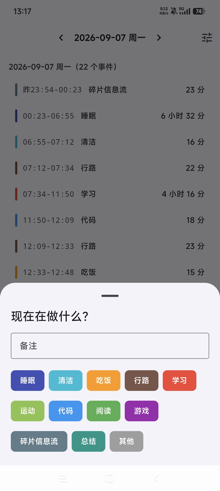
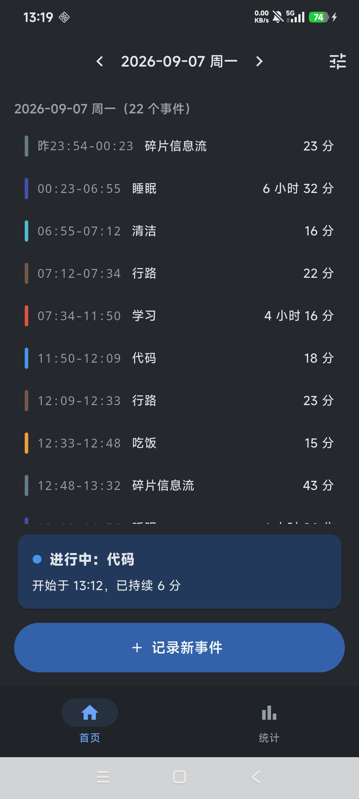

# DailyTimestamp · 时间戳

> 以「打卡」方式记录一天的时间去向：点一下标签即开始，下一件事开始时上一件自动结束，时间线无缝衔接。按日统计各分类时长与占比，数据完全本地化。

|                   打卡页                   |                   统计页                    |
| :----------------------------------------: | :-----------------------------------------: |
|  |  |
|     |       |

## 功能

**打卡与时间轴**

- 点标签立即开始记录，备注可选；任意时刻至多一个进行中事件，事件之间无缝衔接
- 时间轴行：`开始-结束 · 分类色条 · 标签 · 备注 · 时长`
- AppBar `<` / `>` 切换查看日，回看与修改邻近日期

**事件修正（防误触）**

- 修改事件：复用打卡弹窗，改类别 + 备注
- 与上一个合并：误点标签后一键并回前一事件
- 拆分事件：双滚轮在事件时段内任选拆分时刻

**分类管理**

- 添加 / 删除 / 上下排序（排序即打卡弹窗标签顺序）
- 每个分类可自定义颜色；色条、色点、占比条、统计条形全局同步

**统计**

- 月历条：默认显示本周，点月份标题展开整月；有记录的日期带圆点，点选跳转
- 按日聚合：各分类时长 + 占比条形 + 百分比，空档时长固定排最后

**数据安全**

- 单文件 JSON 存储=
- 自动存档 + 手动导出 ，数据存 Documents 目录，卸载重装不丢失

**外观**

- 明亮 / 深色 / 跟随系统三态，统计页顶部一键切换
